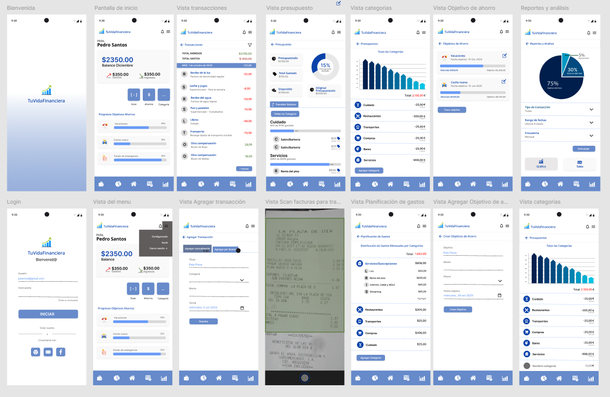

# **TU VIDA FINANCIERA**
**Máster en Ingeniería Informática**

Tecnologías y desarrollo en dispositivos móviles

Documento de Proyecto
Tu Vida Financiera

Integrantes:

●	Diomaris Durán ( ddg00011@red.ujaen.es ) 
●	Dainy Ramirez Ramirez ( drr00044@red.ujaen.es ) 
●	Paúl Paillacho ( ppp00031@red.ujaen.es )

## CARACTERÍSTICAS
Tu Vida Financiera es una aplicación diseñada para ayudarte a gestionar y optimizar tus finanzas personales de manera efectiva y conveniente. Nuestro objetivo es empoderarte con herramientas y conocimientos que te permitan tomar decisiones financieras informadas y alcanzar tus metas económicas.  

Con Tu Vida Financiera, se podrá realizar lo siguiente:  
•	Monitorear tus Gastos: Lleva un control detallado de tus ingresos y egresos en diversas categorías, permitiéndote identificar patrones de gasto y áreas de oportunidad para ahorrar.  
•	Establecer Presupuestos: Define presupuestos mensuales o semanales para diferentes categorías y realiza un seguimiento de tu progreso para asegurarte de que te mantienes dentro de los límites establecidos.  
•	Planificar tus Metas Financieras: Fija objetivos de ahorro a corto y largo plazo y recibe orientación y sugerencias para alcanzarlos de manera efectiva.  
•	Recibir Reportes y Análisis: Obtén reportes visuales y análisis detallados de tus finanzas, lo que te permitirá comprender mejor tu situación económica y hacer ajustes necesarios.  
•	Gestionar Transacciones: Registra y categoriza tus transacciones diarias de manera fácil y rápida, manteniendo un registro ordenado y accesible de tu historial financiero.  

Proyecto en Jira:
https://dtm2024.atlassian.net/jira/software/projects/KAN/boards/1 

Proyecto de github
https://github.com/TuVidaFinanciera-Organizacion/TuVidaFinancieraApp.git

## INSTALACIÓN

REACT NATIVE 
Instalar Node.js 
1.	Descarga e instala Node.js desde su sitio web oficial.
2.	Verifica la instalación ejecutando node -v en la terminal.

Instalar Java Development Kit (JDK) 
1.	Descarga e instala JDK (Java Development Kit) desde el sitio web oficial de Oracle o OpenJDK.
2.	Verifica la instalación ejecutando java -version en la terminal.
 
Instalar React Native CLI 
1.	Abre la terminal y ejecuta el siguiente comando para instalar React Native CLI:
 
npm install -g react-native-cli 
npm install -g expo-cli
 
Instalar Expo Go  
Para realizar las pruebas del desarrollo sin instalar emulador en equipo se debe instalar Expo Go en el teléfono. 
Aquí se escaneará el código QR que se genere al momento de ejecutar el aplicativo GIT 
Instalar GIT 
https://git-scm.com/ 
Configurar el Nombre de Usuario y el Correo Electrónico 
Git utiliza tu nombre de usuario y correo electrónico para registrar quién realizó cada cambio en tu repositorio. Abre una terminal y ejecuta los siguientes comandos: 
1.	Establecer tu nombre de usuario: 
sh 
git config --global user.name "Tu Nombre" 
2.	Establecer tu correo electrónico: 
sh 
git config --global user.email tu.correo@example.com  

 

Descarga de Código

 

Ingresar la siguiente ruta 
https://github.com/TuVidaFinanciera-Organizacion/TuVidaFinancieraApp.git
 

Pasos para cargar las modificaciones a GIT REMOTO 
Primero descargar los cambios remotos 
  
Luego hacer commit y push
 
 
Se abrirá una perspectiva en la parte derecha el ide, en el cual colocamos un comentario  
 
Luego pulsamos confirmar, enviar y sincronizar 
 
Ejecutar proyecto EXPO  TuVidaFinancieraApp 
1)	Ingresamos a la carpeta donde descargamos el código 
2)	abrimos una ventana cmd 
3)	Ejecutar el comando para actualizar el proyecto  
a.	npm install -g expo-cli 
4)	Ejecutar comando para iniciar el proyecto 
a.	npx expo start --tunnel 
5)	Abrir el aplicativo EXPO GO y escanear el código QR 
6)	También se puede ingresar al link del servidor
  

